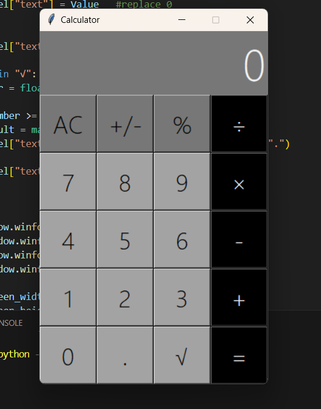

# 🧮 Calculator App

A desktop calculator application built with Python and Tkinter.

## ✨ Features

- Addition
- Subtraction
- Multiplication
- Division
- Square Root Calculation
- Percentage Calculation
- Positive / Negative Toggle
- Decimal Number Support
- Error Handling
- Custom Tkinter GUI

## 🛠️ Technologies Used

- Python 3
- Tkinter
- Math Module

## 📸 Screenshot

## 🚀 Installation

### Clone the repository

git clone https://github.com/Ezz08/Calculator.git

### Navigate to the project directory

cd calculator-app

### Run the application

python main.py

## 📂 Project Structure

calculator-app/
│
├── main.py
├── screenshot.png
└── README.md (on Github)

## 🎯 Learning Outcomes

This project helped me practice:

- GUI development with Tkinter
- Event-driven programming
- Python functions and code organization
- Error handling and validation
- Mathematical operations in Python
- State management in desktop applications

## 🔮 Future Improvements

- Keyboard support
- Scientific calculator functions
- Calculation history
- Dark/Light mode
- Improved UI design

## 👨‍💻 Author

 EZZ Fawzy Fathy Ahmed

⭐ Feel free to star the repository if you found it useful.
